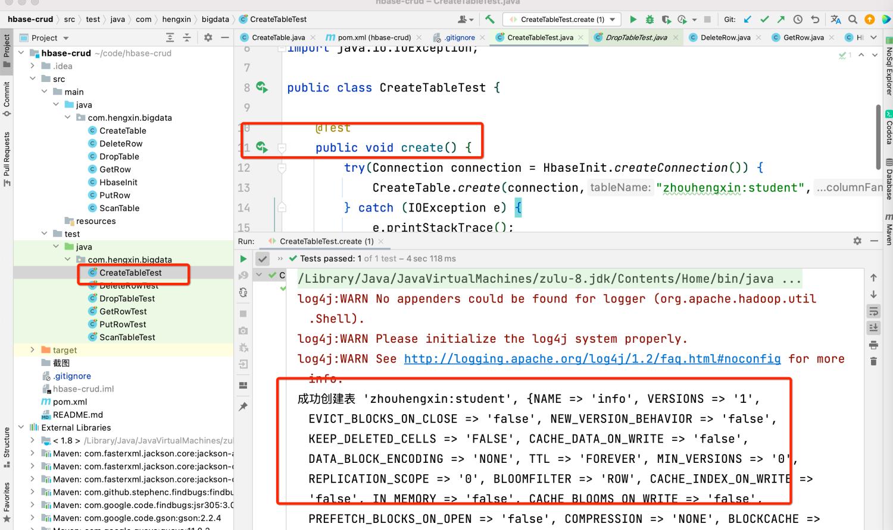
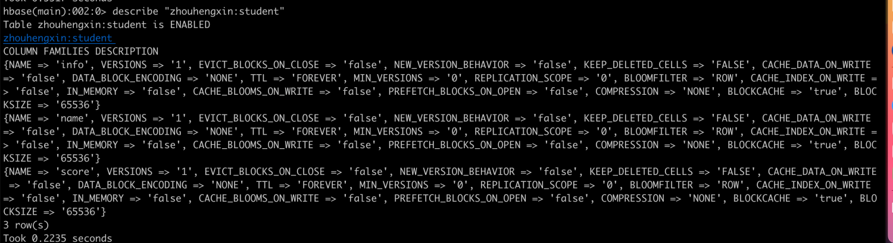
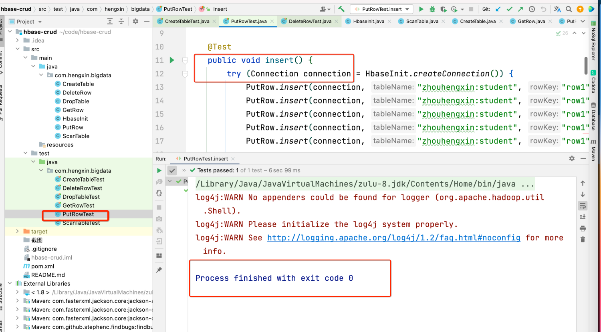
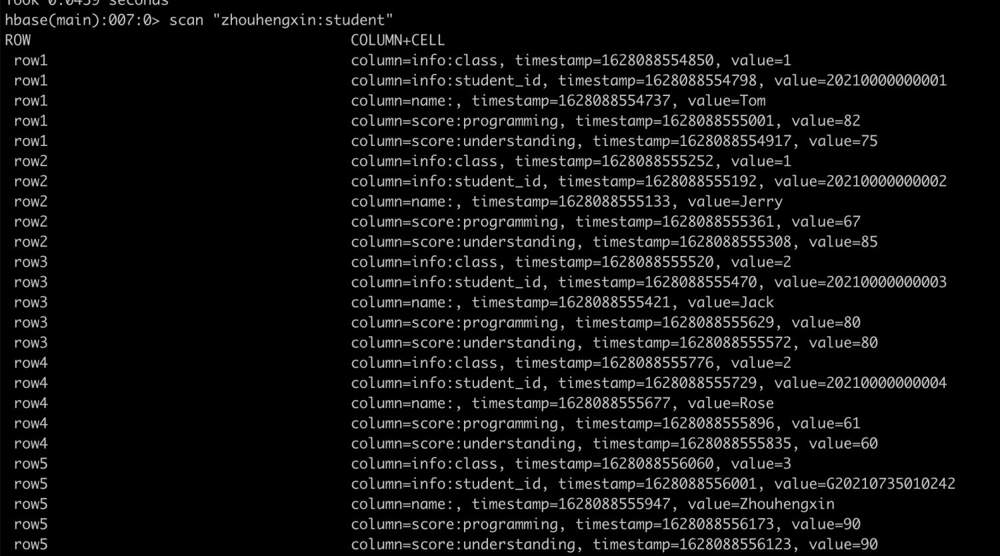
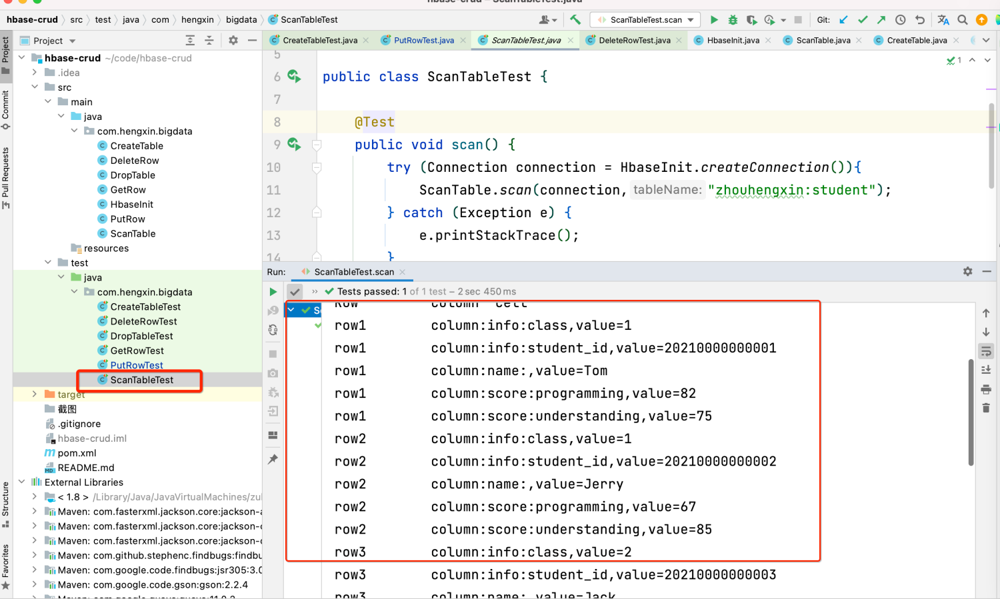
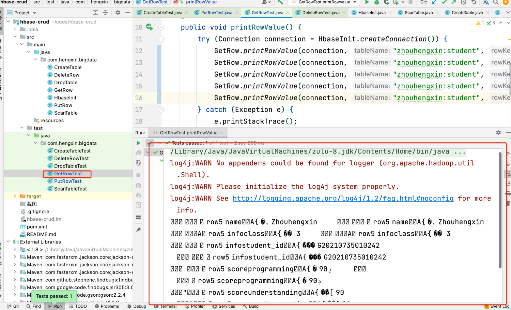
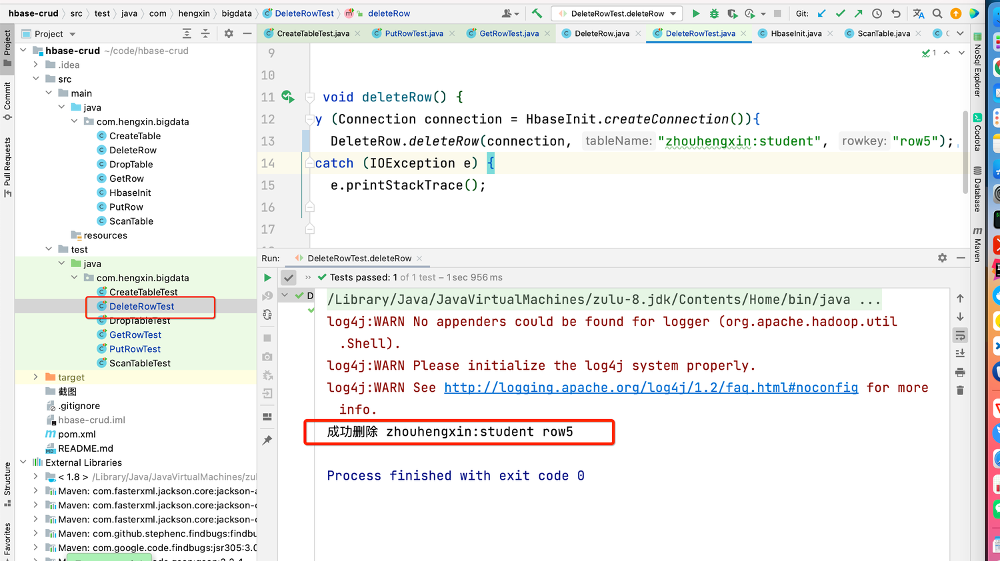
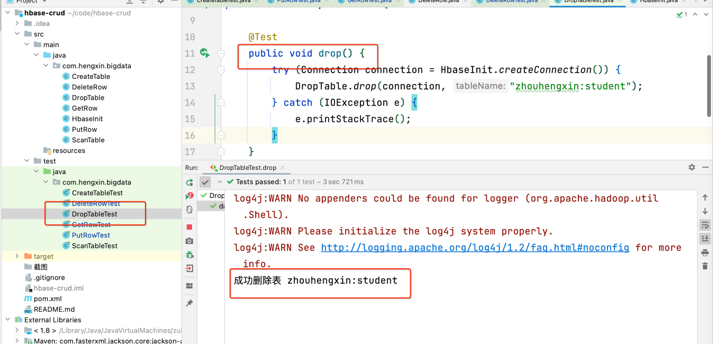
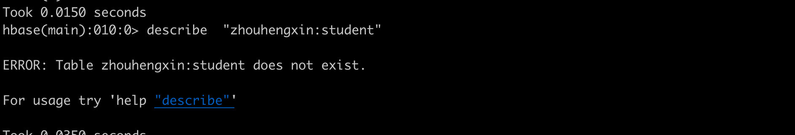

# 1. 运行创建表
   创建 **zhouhengxin:student** 表

Hbase shell 可以看到 存在 **zhouhengxin:student**  表了。

# 2 插入数据


Hbase shell 可以看到插入成功


# 3. 全表扫描数据


# 4 根据rowKey查询某行数据
根据rowkey 查询 rowKey为 **"row5"** 的 数据 数据

# 5 根据rowkey删除某行
删除rowKey为 **"row5"** 的 数据

hbase shell 里查不到rowKey为 **"row5"** 了。

# 6 删除表

hbase shell 查不到 **"zhouhengxin:student"** 这个表了


# 备注

要在 hosts 添加 ip域名绑定才能跑得起来，主要是Zookeeper的ip

```shell
47.101.206.249 jikehadoop01
47.101.216.12  jikehadoop02
47.101.204.23  jikehadoop03
```


