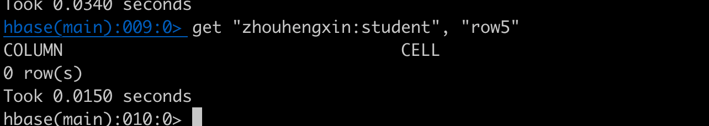

1. 运行创建表
   创建 zhouhengxin:student 表

Hbase shell 可以看到 存在zhouhengxin:student 表了。

2 插入数据

Hbase 可以看到插入成功

3. 全表扫描数据

4 根据rowKey查询某行数据
根据rowkey 查询 rowKey为 "row5" 的 数据 数据

5 根据rowkey删除某行
删除rowKey为 "row5" 的 数据

hbase shell 里查不到rowKey为 "row5" 了。

6 删除表

hbase shell 查不到 "zhouhengxin:student" 这个表了

